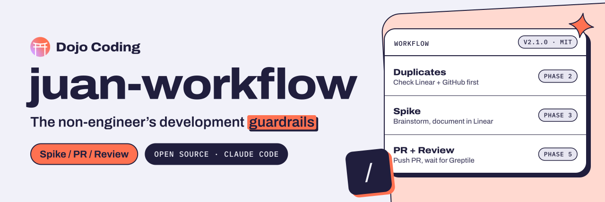

<p align="center">
  <a href="https://dojocoding.io">
    <picture>
      <source media="(prefers-color-scheme: dark)" srcset="docs/assets/banner-dark.svg">
      <source media="(prefers-color-scheme: light)" srcset="docs/assets/banner-light.svg">
      
    </picture>
  </a>
</p>

# juan-workflow

**A Claude Code plugin that runs the full development lifecycle, from spike to PR to review, for non-engineers who ship code.**

[](https://github.com/DojoCodingLabs/juan-workflow)
[](https://opensource.org/licenses/MIT)
[](https://github.com/topics/claude-code-plugin)
[](https://github.com/DojoCodingLabs/juan-workflow)

[Get started](#installation) · [What it does](#what-it-does) · [Usage](#usage) · [Contribute](#contributing) · [Report an issue](https://github.com/DojoCodingLabs/juan-workflow/issues/new)

---

## The Origin Story

Juan is Head of Product & Growth at [Dojo Coding Labs](https://dojocoding.io). He's not an engineer. He's a product guy who lives in Linear, thinks in user stories, and has strong opinions about button colors.

One day Juan decided he was tired of writing PRDs and waiting. He wanted to *contribute to the codebase*. The engineers were... concerned.

> "What if he pushes to main?"
> "What if he duplicates work someone's already doing?"
> "What if he skips the spike and just starts coding?"
> "What if Greptile roasts him and he doesn't fix it?"

So Juan did what any self-respecting Head of Product would do: **he built guardrails for himself.**

The result is **juan-workflow** — a Claude Code plugin that enforces the full development lifecycle every single time Juan sits down to code. Spike first. Check for duplicates. Get Greptile approval. Assign a human reviewer. No shortcuts.

**The engineers love it.** Juan ships code now. Nothing breaks. And the workflow is so good the whole team uses it.

Open-sourced because if Juan can do it, anyone can. 🤷

---

## What It Does

One command — `/juan-workflow:juan-is-working` — orchestrates your entire dev session:

```
Phase 0  🔍  Setup         Learn your team's patterns (first run only)
Phase 1  🎯  Discovery     What are we building? Assess scope.
Phase 2  🔎  Duplicates    Check Linear + GitHub for existing work
Phase 3  📌  Spike         Create spike in Linear, brainstorm, document
Phase 4  🏗️  Build         Create task, branch, implement, lint, test
Phase 5  🚀  PR + Review   Push PR, wait for Greptile, address feedback
Phase 6  👋  Handoff       Assign reviewer (round-robin), update Linear
```

Every phase confirms before advancing. Everything is cross-linked (Linear ↔ GitHub). Nothing falls through the cracks.

---

## Installation

```bash
# In Claude Code:
/plugin marketplace add DojoCodingLabs/juan-workflow
/plugin install juan-workflow@juan-workflow
```

That's it. Type `/juan-workflow:juan-is-working` and you're off.

### Updating

```bash
# Update the marketplace catalog first:
/plugin marketplace update DojoCodingLabs/juan-workflow

# Then update the plugin:
/plugin update juan-workflow@juan-workflow
```

Restart your Claude Code session after updating.

> **Requires:**
> - [Claude Code](https://code.claude.com) with plugin support
> - [GitHub CLI](https://cli.github.com) (`gh`) — authenticated
> - [Linear MCP](https://www.npmjs.com/package/@linear/mcp-server) — connected to Claude Code
> - [jq](https://jqlang.github.io/jq/) — `brew install jq` (macOS) or `apt install jq` (Linux)
> - [Greptile](https://greptile.com) GitHub App — recommended but optional

### Local Development

```bash
git clone https://github.com/DojoCodingLabs/juan-workflow.git
cd juan-workflow

# In Claude Code:
/plugin marketplace add .
/plugin install juan-workflow
```

---

## Usage

### Every time you sit down to work:

```
/juan-workflow:juan-is-working
```

Or with a task description:

```
/juan-workflow:juan-is-working add a search bar to the movie list page
```

### The workflow walks you through:

1. **"What do you want to work on?"** — Explain your task
2. **Duplicate check** — Makes sure nobody's already doing this
3. **Spike** — Brainstorm back and forth, document decisions in Linear
4. **Implementation** — Create branch, code, lint, test
5. **PR** — Push and wait for Greptile review
6. **Handoff** — Assign a human reviewer, update Linear

### Works with /feature-dev

For large tasks, the workflow will suggest using `/feature-dev` for the implementation phase. It handles everything before (spike, planning) and after (PR, review, handoff) — `/feature-dev` handles the actual coding.

---

## What's Inside

```
juan-workflow/
├── .claude-plugin/
│   ├── plugin.json          # Plugin metadata
│   └── marketplace.json     # Marketplace catalog
├── commands/
│   └── juan-is-working.md   # 🧠 The main orchestrator (all 7 phases)
├── agents/
│   ├── pattern-learner.md   # 🔍 Discovers org patterns (Phase 0)
│   └── duplicate-checker.md # 🔎 Finds overlapping work (Phase 2)
├── scripts/
│   ├── wait-greptile.sh     # ⏳ Polls for Greptile review (Phase 5)
│   └── assign-reviewer.sh   # 🎯 Round-robin reviewer pick (Phase 6)
├── LICENSE
└── README.md
```

### Pattern Learning (Phase 0)

On first run, the **pattern-learner** agent analyzes your repo and Linear workspace:

- **Branch naming conventions** — analyzes 20+ recent branches to detect the pattern
- **PR title format** — learns from 10 recent PRs
- **Team members** — builds the reviewer pool from GitHub collaborators
- **Linear workflow states** — maps all states and their IDs
- **Labels** — finds the Spike label (and others)
- **Greptile bot** — detects if Greptile is configured and its username

Everything is saved to `.claude/juan-workflow-learned.local.json` (gitignored). Re-learned automatically if the config is older than 7 days.

### Greptile Gating (Phase 5)

After creating a PR, the workflow waits for Greptile:

- **6 minute** initial wait
- **2 minute** retry intervals
- **15 minute** max wait
- If Greptile has feedback → address it, push, re-wait
- If 3 rounds without clean review → offer escape to human review
- If Greptile isn't configured → skip gracefully

### Round-Robin Reviews (Phase 6)

Reviewers are assigned from the learned team pool in round-robin order. The index persists in the config file so it rotates fairly across sessions.

---

## Error Handling

| Situation | What happens |
|-----------|-------------|
| Linear MCP unavailable | Warns, continues GitHub-only |
| `gh` not authenticated | Shows error, asks to run `gh auth login` |
| Greptile timeout (>15 min) | Asks: wait more / proceed / check manually |
| Config missing mid-workflow | Re-triggers Phase 0 |
| Branch name collision | Appends numeric suffix |
| Greptile loop >3 rounds | Warns, offers escape to human review |
| Juan says "stop" | Graceful exit, shows what was created |

---

## Requirements

| Tool | Required | Notes |
|------|----------|-------|
| Claude Code | ✅ | With plugin support |
| GitHub CLI (`gh`) | ✅ | Must be authenticated (`gh auth login`) |
| Linear MCP | ✅ | Connected to Claude Code |
| `jq` | ✅ | For scripts (`brew install jq`) |
| Greptile | 📋 Recommended | If not present, review gating is skipped |
| `/feature-dev` | 📋 Optional | For large feature implementation |

---

## Future (v2+)

- 🔔 Slack notifications on PR ready
- 📊 Cycle time analytics
- 🔄 Auto-resume interrupted workflows
- 👥 Team mode (not just Juan)
- 🤖 Greptile MCP integration (when available)
- 📦 Multi-task batching
- 📍 Review follow-up monitoring

---

## Contributing

This started as a joke plugin for one non-engineer. Now the whole team uses it. If you want to make it better:

- **🐛 Bug fixes** — Found an issue? Open a PR
- **🔧 New phases** — Got an idea for a workflow step? Let's talk
- **🌍 Translations** — Help us add more bilingual touches
- **📝 Better docs** — Always welcome

---

## Built by Dojo Coding Labs

[Dojo Coding Labs](https://dojocoding.io) is a LATAM-first tech education and product studio. We build tools for developers and teach people to code.

**juan-workflow** is free forever. Open source. MIT licensed. If a Head of Product can ship code safely, so can you.

### More from Dojo Coding

- **[CodeSensei](https://github.com/DojoCodingLabs/code-sensei)** — Learn to code while you vibecode
- **[VibeCoding Bootcamp](https://dojocoding.io/bootcamp)** — Structured curriculum with live mentors
- **[DojoOS](https://dojocoding.io/dojoos)** — Full developer environment and community

---

## License

MIT License — free to use, modify, and distribute. Built by [Dojo Coding](https://dojocoding.io).

<p align="center">
  <a href="https://dojocoding.io"></a>
</p>
